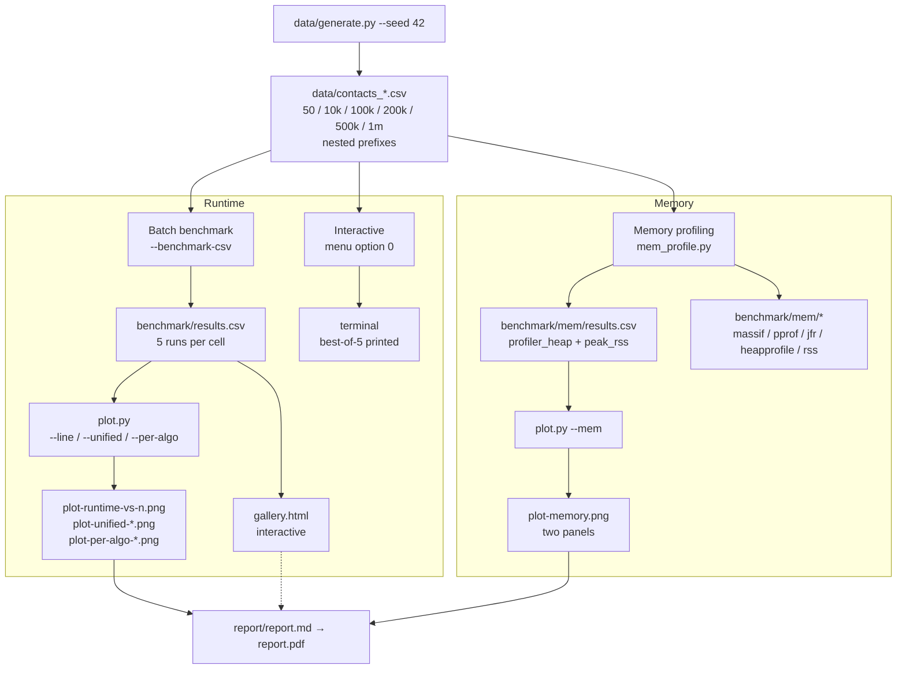
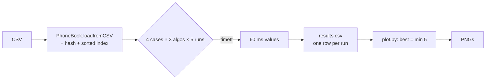
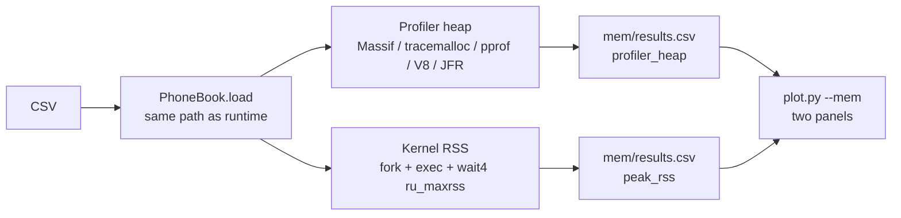

# 09 — Architecture

How the harness is organized, how data flows, and where benchmark code lives vs user-facing code.

## File map

```
.
├── Makefile                         # build + run-benchmark + run-benchmark-sizes + run-memory
├── CMakeLists.txt / CMakePresets.json
├── data/
│   ├── generate.py                  # seeded CSV generator (nested prefixes, seed 42)
│   └── contacts_*.csv               # 50 / 10k / 100k / 200k / 500k / 1m
├── include/
│   ├── timer.hpp                    # timeIt / benchmark / printTaskDuration (source of truth)
│   ├── contact.hpp                  # Contact struct (no benchmark code)
│   ├── hashtable.hpp                # HashTable interface (no benchmark code)
│   └── phonebook.hpp                # PhoneBook interface (no benchmark code)
├── src/
│   ├── main.cpp                     # CLI menu + runSearchBenchmark (opt 0) + runSearchBenchmarkBatch (--benchmark-csv)
│   ├── phonebook.cpp                # CSV, insert, linear/hash/binary search, sorted index
│   └── hashtable.cpp                # chained hash, prime sizing, rehash at 0.75
├── python/phonebook/
│   ├── main.py                      # faithful port of src/main.cpp (menu + both benchmark modes)
│   ├── phonebook.py / hashtable.py / contact.py / timer.py
├── go/phonebook/
│   ├── main.go                      # faithful port of src/main.cpp
│   ├── phonebook.go / hashtable.go / contact.go / timer.go
│   ├── memprofile_test.go           # env-gated TestMemProfile (pprof, GC on live HeapAlloc)
│   └── go.mod
├── javascript/phonebook/
│   ├── src/main.js                  # faithful port of src/main.cpp
│   ├── src/phonebook.js / hashtable.js / contact.js / timer.js
│   └── package.json
├── java/phonebook/
│   ├── src/com/phonebook/Main.java  # faithful port of src/main.cpp
│   ├── src/com/phonebook/PhoneBook.java / HashTable.java / Contact.java / Timer.java
│   ├── src/com/phonebook/MemProfile.java  # JFR + polled heap (compiled with app)
│   └── out/                         # compiled classes (git-ignored)
├── benchmark/
│   ├── results.csv                  # runtime: every run (5 per cell)
│   ├── plot.py                      # all plotting modes (overview / --line / --unified / --per-algo / --mem)
│   ├── gallery.html                 # interactive browser for results.csv (Chart.js + PapaParse)
│   ├── mem_profile.py               # memory orchestrator (5 profilers + kernel RSS)
│   ├── mem/
│   │   ├── profile_python.py        # tracemalloc wrapper
│   │   ├── profile_js.js            # V8 heapUsed + --heap-prof wrapper
│   │   ├── results.csv              # memory: profiler_heap + peak_rss (60 rows)
│   │   ├── massif-*.out / massif-*-msprint.txt
│   │   ├── tracemalloc-*.txt
│   │   ├── go-*.pprof / go-*-pprof-top.txt
│   │   ├── js-*.heapprofile / js-*.txt
│   │   ├── java-*.jfr / java-*-jfr-summary.txt
│   │   └── rss-*-*.txt
│   └── plot*.png                    # generated charts
├── report/report.md → report.pdf    # Parts A, B, D (uses the charts)
└── docs/                            # ← you are here
    ├── README.md                    # hub + 30s quickstart
    ├── 01-concepts.md               # wall-clock, RSS, heap, JIT, complexity
    ├── 02-datasets.md               # generator, schema, nested prefixes
    ├── 03-timing-harness.md         # timeIt / benchmark
    ├── 04-benchmark-modes.md        # interactive vs batch, 12 cells, CSV schema
    ├── 05-running-benchmarks.md     # make targets, manual commands
    ├── 06-memory-profiling.md       # mem_profile.py, 5 profilers, wait4
    ├── 07-plotting-and-gallery.md   # plot.py modes, gallery.html
    ├── 08-interpreting-results.md   # best-of-5, stdev, JIT, pitfalls
    ├── 09-architecture.md           # this file
    └── 10-faq.md                    # troubleshooting + recipes
```

## Data flow



### Runtime path (detail)



### Memory path (detail)



## Where benchmark code lives

A common question: "is benchmark code mixed with user code?"

| Location | Benchmark? | Notes |
|----------|-----------|-------|
| `include/contact.hpp`, `hashtable.hpp`, `phonebook.hpp` | ❌ clean | Zero benchmark code |
| `include/timer.hpp` | dual-use | `printTaskDuration` = menu; `timeIt`/`benchmark` = benchmark (but `phonebook.cpp:insertContact` uses `timeIt` for split timing) |
| `src/main.cpp` | dual | Menu + `runSearchBenchmark` (opt 0) + `runSearchBenchmarkBatch` (--benchmark-csv) — ~30-45% of file |
| `python/phonebook/main.py`, `go/phonebook/main.go`, `javascript/phonebook/src/main.js`, `java/phonebook/src/com/phonebook/Main.java` | dual | Faithful ports of `src/main.cpp` — same split, by design |
| `go/phonebook/memprofile_test.go` | ✅ benchmark-only | Env-gated `TestMemProfile` (`MEMPROFILE_CSV`/`OUT`) |
| `java/.../MemProfile.java` | ✅ benchmark-only | Compiled with app via `javac *.java`, run separately |
| `benchmark/mem/profile_python.py`, `profile_js.js` | ✅ benchmark-only | Wrappers that load the real `PhoneBook` under a profiler |
| `benchmark/mem_profile.py`, `benchmark/plot.py`, `benchmark/gallery.html` | ✅ benchmark-only | Orchestration + visualization |

> **Duplication is intentional.** Every `main.*` is a line-by-line faithful port of `src/main.cpp` so the five languages run the same work. The Makefile's `run-benchmark` and `run-benchmark-sizes` duplicate the 5-lang command list for the same reason — same work, different `n`.

## Build & orchestration duplication

```
Makefile:run-benchmark        ─┐
Makefile:run-benchmark-sizes  ─┤─ same 5-lang --benchmark-csv list, different n
benchmark/mem_profile.py:build_all + measure_rss ─┘  (also builds + runs --benchmark-csv for RSS)
```

If you add a language, update all three places.

## Key invariants

- **Same load path** for runtime and memory: `CSV → contacts + hash buckets + sorted index`. No search during memory measurement — just holding the data.
- **Target indexing is deterministic** — `target_index` + `phone` in CSV make the benchmark auditable across languages.
- **Every run is kept** — 5 rows per cell, not an average. `best = min(5)` is derived, not stored.
- **Evidence is kept** — `benchmark/mem/*.out|.pprof|.jfr|.heapprofile` are not temp files; they are the proof for the report.

---

Next: [10 — FAQ](10-faq.md) — troubleshooting and quick recipes.
