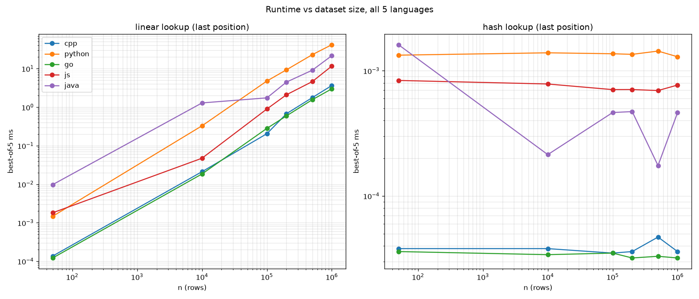
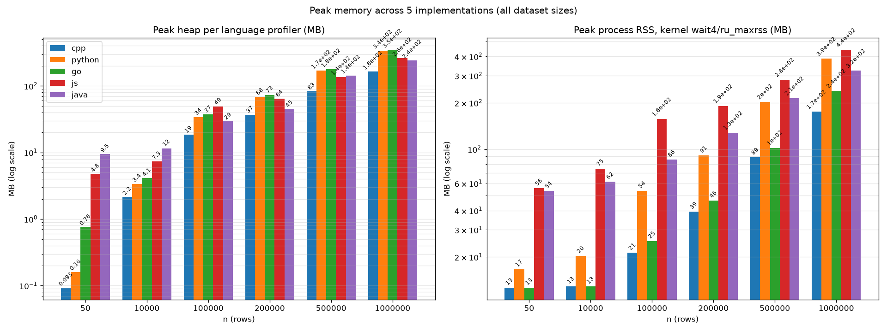
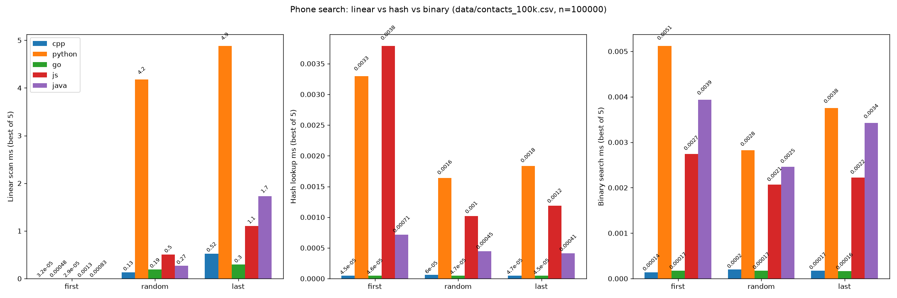

# Phonebook Lookup — Group Report (Parts A, B, D)

**Group G4 — Searching & Hash tables (§2.2)** · Linear · Binary · Interpolation · Hashing & collisions · Demo: phone-book lookup (n ≥ 100k) · Members: <!-- TODO: names + IDs --> · Build/run & machine spec: [`README.md`](../README.md)

> Parts A, B, D of `C0B_Group_Project_Guide.pdf`. Contribution & AI-use declarations in Appendix.

---

## Part A — Position & purpose

### A.1 Syllabus map

| Structure | Ref | LO | Built on | Built on top |
| --- | --- | --- | --- | --- |
| Linear search | §2.2.2 p.3 | LO2 | unsorted array | — (baseline; inner loop of hash chains) |
| Binary search | §2.2.3 p.3 | LO2 | sorted array | ancestor of BST/B-trees |
| Interpolation search | §2.2.4 p.4 | LO2 | sorted array, uniform keys | — |
| Hashing & collisions | §2.2.5 p.4 | LO2+LO3 | array buckets + linked-list chaining | dicts, caches, DB hash indexes |

Refs: course syllabus `3-Data Structure and Algorithm-CLC.pdf` (INT1306_CLC, 2026-09-11); CLRS 4th ed. Ch.11 Hash Tables (§11.1–11.4), MIT Press 2022 (3rd ed. pp.253–280).

### A.2 Motivation

**Linear search** — finds a record with no order/index by scanning until `phone==target` (`phonebook.cpp:250`). Fine for dozens, unusable at 100k (up to 100k compares per lookup). Baseline every other structure improves on; survives as hash-chain scan (`hashtable.cpp:hashSearch`). Wrong when lookups are frequent/large or data is sorted (binary dominates).

**Binary search** — exploits order: each probe halves the range, so 100k needs ≤17 compares vs 100k. Wastes sorted order if you scan linearly. Built on sorted array (`buildSortedIndex()` O(n log n) once; `lowerBound` O(log n)+`vector::insert` shift O(n) per insert, `phonebook.cpp:177`). Ancestor of tree indexes. Wrong when unsorted (sorting cost > scan), frequently mutated (O(n) insert to keep order vs hash O(1)), or keys have no order (exact phone match → hash better).

**Interpolation search** — probes by value proportion, O(log log n) expected on uniform keys vs binary O(log n). Binary's indifference to value is wasteful when target is near an end. Built on sorted uniform keys (binary's smarter cousin). Wrong on skewed data (degenerates O(n) probing one-by-one) — phone strings are not uniform, so demo covers it only in theory (§2.2.4, no code in `src/` or ports) — and on small n where binary's constants win.

**Hashing & collisions** — maps each key directly to a bucket, so lookup, insert and delete are O(1) expected at any n — no scan, no halving, no sorted order to maintain. Linear costs O(n) per lookup; binary costs O(log n) per lookup but O(n) per insert to keep order. Neither scales when a phonebook grows by thousands per day. Built on a bucket array with one linked list per bucket (chaining): 64-bit polynomial hash `hash*31+(c-'0')` with wrap, `% numBuckets` (`hashtable.cpp:HashForSize`), starting at 101 → nextPrime and rehashing at load > 0.75 to nextPrime(2×) (`isPrime` via 6k±1). Colliding keys share a chain that is scanned linearly. This underpins dicts, caches and DB hash indexes. Avoid it for range queries ("phones starting with 09" needs a sorted array or BST), when a hard worst-case guarantee is required (a pathological collision pattern collapses to an O(n) chain, while a balanced BST guarantees O(log n)), or when memory is tight (a low load factor wastes buckets).

---

## Part B — Algorithms & complexity

### B.1 Operation table

Demo implements linear, binary (sorted phone index), and hash table; interpolation is topic (§2.2.4) included for completeness but not implemented (needs uniform keys). A number without justification scores nothing.

| Operation | Best | Avg | Worst | Space | Why |
| --- | --- | --- | --- | --- | --- |
| Linear search by phone | O(1) | O(n) | O(n) | O(1) | No index — scan until found; first hit O(1), miss scans n. |
| Binary search by phone | O(1) | O(log n) | O(log n) | O(1) | Halves range per probe; needs sorted array. |
| Interpolation search | O(1) | O(log log n) | O(n) | O(1) | Value-proportion probe; O(log log n) only if uniform, else O(n). |
| Hash insert | O(1) | O(1) | O(n) | O(1) | Hash→bucket, append to chain; O(n) if all collide. |
| Hash search | O(1) | O(1) | O(n) | O(1) | Hash→bucket, walk chain; expected O(1), worst single chain. |
| Hash delete | O(1) | O(1) | O(n) | O(1) | Find in chain then unlink; same as search. |
| Rehash (load>0.75) | O(n) | O(n) | O(n) | O(n) | Reinsert all keys into doubled buckets; amortised O(1)/insert. |

### B.2 Implementation notes (C++ source)

* **CSV** `phonebook.cpp:30-83`: quoted `"Do, Thanh Tuan"` with `""` escapes, unquoted split on last comma, trim/strip quotes/`\r`, skip blank/empty-name/non-digit-phone.
* **Insert** `143-164`: reject empty/non-digit/duplicate phone (hash check), store `CapitalizeFirst(ToLower(name))` + hash index.
* **Delete** (opt 8): O(n) vector erase + full hash rebuild; missing phone → `Phone number not found`.
* **Search:** `searchLinearByPhone` exact scan; `searchHashByPhone` chain lookup; `searchBinaryByPhone` hand-written binary on sorted index (O(log n) → hash resolve); `searchLinearByName` case-insensitive scan.
* **Sorted index** `buildSortedIndex`: bulk load then sort once O(n log n); per-insert `lowerBound` O(log n)+shift O(n) with split `hash / sorted-index` timing; delete rebuilds.
* **Hash** `hashtable.cpp`: poly hash 64-bit wrap `% numBuckets`; 101→nextPrime; rehash 0.75→nextPrime(2×); `isPrime` 6k±1.
* **Timer** `timer.hpp`: `timeIt` ms, `benchmark(work,5)` best-of-5, `printTaskDuration` → `\nTook: Xms.`
* **Benchmark** `main.cpp:11-63` opt 0: auto-loads CSV, picks `first/middle/random/last/miss` phones (`miss=0000000000` true worst for hash/binary), times linear/hash/binary ×5.

---

## Part D — Cross-language comparison

### D.1 Scope & file map

Same hand-rolled chained hash + linear scan + binary on sorted index over `contacts_100k.csv` (n=100k) in all five languages — no `dict`/`map`/`HashMap`. This is a *language+runtime* comparison of equivalent code, not hand-written C++ vs Python's built-in `dict` (different question).

| C++ | Python | Go | JS (Node) | Java |
| --- | --- | --- | --- | --- |
| `src/main.cpp` | `python/phonebook/main.py` | `go/phonebook/main.go` | `javascript/phonebook/src/main.js` | `java/phonebook/src/com/phonebook/Main.java` |
| `src/phonebook.cpp`+`phonebook.hpp` | `phonebook.py` | `phonebook.go` | `src/phonebook.js` | `PhoneBook.java` |
| `src/hashtable.cpp`+`hashtable.hpp` | `hashtable.py` | `hashtable.go` | `src/hashtable.js` | `HashTable.java` |
| `include/timer.hpp` | `timer.py` | `timer.go` | `src/timer.js` | `Timer.java` |
| `include/contact.hpp` | `contact.py` | `contact.go` | `src/contact.js` | `Contact.java` |

Differences are only runtime-forced (64-bit wrap, stdin, timing API).

### D.2 Comparison table

| Criterion | C++ | Python | Java | JavaScript | Go |
| --- | --- | --- | --- | --- | --- |
| Built-in used | hand chain `vector<HashNode*>`; only `vector/sort` | hand chain `list`; only `list/sorted()` | hand chain `HashNode[]`; only `ArrayList/sort` | hand chain `Array`; only `Array/sort/splice` | hand chain `[]*HashNode`; only `slice/sort` |
| Effort | highest: `new/delete`, header split, `=delete`, 6k±1, rehash, CSV state machine, `lowerBound`, CMake `-O2` | lowest: `dataclass+list`, `& MASK64`, `""`-CSV, `lowerBound`, `perf_counter` | high: `remainderUnsigned`, `HashNode[]`, NIO.2 CSV, `lowerBound`, `nanoTime`, `javac -d` | high: `BigInt & MASK64`, `perf_hooks`, `readline` CLI, `mulberry32(42)` | medium: `uint64` wraps free; chaining/CSV/`lowerBound`/`time.Now`, `go run` |
| Runtime | D.3/D.7 | D.3/D.7 | D.3/D.7 | D.3/D.7 | D.3/D.7 |
| Memory | lowest: ~173 MB heap at 1M (Massif) | ~2× C++: ~356 MB at 1M (tracemalloc) | ~2× C++: ~367 MB HeapInuse at 1M (pprof) | live ~206 MB at 1M, RSS baseline ~55 MB | polled ~255 MB at 1M; RSS ~215 MB |
| Mgmt | manual RAII, deterministic, no GC | refcount + gen. GC | tracing G1, concurrent | V8 gen. GC | G1, may pause |
| Types | strong static `constexpr/const`, `template`, `-Wall` | dynamic + hints (`dataclass`, `List/Callable`) | static+generics, checked `IOException` | dynamic JS `'use strict'`, no TS | static concrete, no generics, errors as `-1/nil` |
| Readability | verbose/explicit; costs visible | most concise; `with open`, f-strings | verbose enterprise; ~2× Python LOC | small, C++-mirroring | explicit; `defer`/`copy`-shift noisy but clear |
| Use when | perf-critical / 1M / embedded: `-O2`, no GC | teaching/prototyping/glue; not hot loop (use `dict`) | large-team/enterprise/Android; not terse scripts | demo/web/zero-build CLI; not 100k+ hot path (`BigInt`) | backend/microservice: single binary, `pprof`, GC |

### D.3 Runtime growth

Best-of-5 ms at `last` (index n−1, same phone every lang) across n=50/10k/100k/200k/500k/1M (log-log). Linear ~linear with n; hash flat O(1), binary near-flat O(log n), both position-independent unlike linear.



Per-language detail (every algo × every case vs n, and best/avg/worst per algo) is generated by `benchmark/plot.py` — see `benchmark/gallery.html` and `benchmark/plot-unified-*.png` / `plot-per-algo-*.png` (10 images, omitted here for length; all 28 PNGs remain in `benchmark/`).

### D.4 Memory profiling

Headless on same load path (CSV→contacts+hash+sorted index) at every n, plus kernel peak RSS (`wait4/ru_maxrss`) as uniform yardstick. Reproduce: `make run-memory`; raw evidence (massif+ms_print, tracemalloc, pprof, `.heapprofile`, JFR) in `benchmark/mem/`.



| n | C++ Massif | Python tracemalloc | Go pprof HeapInuse | JS V8 heapUsed | Java polled heap |
| --- | --- | --- | --- | --- | --- |
| 50 | 0.1 | 0.2 | 0.8 | 5.0 | 10.0 |
| 10k | 2.3 | 3.5 | 4.3 | 7.7 | 14.3 |
| 100k | 19.4 | 35.9 | 39.2 | 31.6 | 31.0 |
| 200k | 38.7 | 71.8 | 77.0 | 78.9 | 51.6 |
| 500k | 86.5 | 178.0 | 186.4 | 142.3 | 161.3 |
| 1M | 172.9 | 356.2 | 367.0 | 206.3 | 254.8 |

Peak RSS (MB, same batch):

| n | C++ | Python | Go | JS | Java |
| --- | --- | --- | --- | --- | --- |
| 50 | 12.6 | 17.1 | 12.6 | 55.7 | 53.2 |
| 10k | 12.9 | 20.7 | 12.9 | 73.0 | 61.3 |
| 100k | 22.9 | 54.4 | 28.7 | 158.9 | 87.6 |
| 200k | 40.5 | 91.8 | 55.0 | 190.8 | 129.9 |
| 500k | 89.0 | 203.7 | 115.9 | 283.1 | 215.7 |
| 1M | 173.6 | 390.4 | 215.3 | 444.7 | 330.4 |

*Why:* **C++** floor — contiguous `vector<Contact>` + SSO, ~173 MB at 1M is the data. **Python** ~2× — every object boxed `PyObject` + header. **Go** ~367 MB HeapInuse — `[]Contact` values but per-`HashNode` allocs; RSS lower due to span accounting. **JS** largest baseline ~55 MB RSS at n=50; live ~206 MB but RSS ~445 MB (V8 heap reservation). **Java** ~53 MB baseline (JVM+G1), ~255 MB polled heap at 1M. Honest claim: data cost ranks C++ < Python≈Go < JS < Java; whole-process cost dominated by baselines at small n. Both panels needed.

### D.5 Statistical fairness

Every cell in `benchmark/results.csv` holds 5 raw runs (`timeIt`, no discard) — 450 cells×5=2250 rows (5 langs×6 sizes×5 cases×3 algos). Opt 0 reports best-of-5; CSV keeps all 5 for mean/stdev/CV offline. No discarded warm-up yet, so run 1 includes cold start. Reproduce: `python3 -c` with `csv.DictReader`, `statistics.mean/stdev`, `CV=stdev/mean`.

Representative at n=1M (`last` = linear worst, same phone every lang), ms `mean ± stdev (best)`:

| Lang | Linear-last | Hash-last | Binary-last |
| --- | --- | --- | --- |
| C++ | 6.76 ±2.27 (4.80) | 0.00018 ±0.00029 (0.000049) | 0.00057 ±0.00080 (0.000169) |
| Python | 65.97 ±1.59 (64.66) | 0.00507 ±0.00663 (0.00191) | 0.00688 ±0.00543 (0.00430) |
| Go | 4.77 ±1.32 (3.99) | 0.00020 ±0.00031 (0.000046) | 0.00102 ±0.00180 (0.000181) |
| JS | 16.75 ±0.63 (16.20) | 0.00292 ±0.00399 (0.00107) | 0.00428 ±0.00464 (0.00211) |
| Java | 37.28 ±2.65 (35.58) | 0.00131 ±0.00144 (0.000564) | 0.00586 ±0.00373 (0.00394) |

Cold-start `first` n=1M `run1/best`: JS 101×/39.6×/21.7×, Java 13.9×/66.1×/5.1×, Python 16×/3.9×/2.7×, C++ 7.9×/17.6×/19.1×, Go 4.8×/19.5×/18.3×. Full 75-cell table generated from CSV (not hand-copied).

*Why Java slow on run 1:* JVM interpreted + class-load/G1, then C1/C2 compile hot loop after ~10k iters — one 100k scan triggers it (`middle-linear` 39→17 ms runs 1–5; tiny hash ops 66× after compile). V8 same (Ignition→TurboFan, settled by run 3–5; `first` coldest as it runs first). C++/Go AOT (`-O2`/`go build`) run-1 excess is cache/branch + sub-µs timer floor (CV 1.4–1.8 on hash/binary). Python no JIT; large linear most stable (CV 0.02–0.04 at 1M).

*Fairness:* best-of-5 mitigates JIT but ≠ discarded warm-up. Fix: 3 untimed discarded searches (same phone, sink assignment) before timed `r=1..5` in `java/.../Main.java:~150` and `javascript/.../main.js:~76`; keep CSV header/seed 42/`miss=0000000000`. Until then compare `min(best)` or `mean(runs 2–5)` for Java/JS and state which.

### D.6 Measurement method

Opt 0 covers 5 targets and prints best-of-5 per target:

```text
[role index N phone P]
  Linear best of 5: Xms. (index N)
  Hash best of 5: Yms. (index N, position-independent)
  Binary best of 5: Xms. (index N, sorted index)
```

`miss=0000000000` (not in dataset) — worst for hash (full chain) and binary (log n); `middle=n/2` — linear avg, binary best (1 probe).

```sh
make run-benchmark          # all 5 langs → benchmark/results.csv (overwrite) + benchmark/plot.png
make run-benchmark-sizes    # ×6 sizes → plot-runtime-vs-n.png + per-lang PNGs
make run-memory             # profilers + RSS → benchmark/mem/results.csv + plot-memory.png
```

Batch mode (75 rows/lang: 5 cases×3 algos×5 runs, seed 42, `target_index,phone` auditable; `miss` index −1):

```sh
make  # builds ./build/cpp/demo
./build/cpp/demo --benchmark-csv benchmark/results.csv data/contacts_100k.csv
python3 python/phonebook/main.py --benchmark-csv benchmark/results.csv --append data/contacts_100k.csv
(cd go/phonebook && go run . --benchmark-csv ../../benchmark/results.csv --append ../../data/contacts_100k.csv)
(cd javascript/phonebook && node src/main.js --benchmark-csv ../../benchmark/results.csv --append ../../data/contacts_100k.csv)
(cd java/phonebook && javac -d out src/com/phonebook/*.java && java -cp out com.phonebook.Main --benchmark-csv ../../benchmark/results.csv --append ../../data/contacts_100k.csv)
```

CSV: `language,dataset,n,case,algo,run,ms,timestamp,toolchain,target_index,phone` — 375 rows single-size, 2250 multi-size. `plot.py` parses all `ms` formats defensively (C++ `setprecision(17)`, Python `repr`, Go `%g`, JS, Java) and draws `plot.png` (3 linear-scale panels, split axes) + line/unified/per-algo PNGs; without matplotlib it prints `plot skipped` and CSV is still produced.



Additional per-case PNGs (`plot-first-*` … `plot-miss-*`, 15 images) remain in `benchmark/` and `benchmark/gallery.html`; omitted here for length.

### D.7 Why the gap

* **C++ `-O2`:** contiguous structs + SSO → tight machine loop, no per-element overhead (baseline).
* **Python:** every `Contact`/`str` boxed `PyObject` + bytecode dispatch + dict lookups → `last-linear` ~10× (100k interpreter steps vs instructions); hash stays small (O(1) → tax once).
* **Go:** compiled value slices → real machine loop, gap is bounds checks + GC barriers, not interpretation — closest to C++.
* **JS (V8):** heap-object array + hidden-class checks + JIT warmup (best-of-5 lets TurboFan settle; spread is tier-up).
* **Java:** `ArrayList<Contact>` refs + C2 after ~10k iters (one 100k scan trips it) + G1 pauses; startup not measured (fair — all langs same).

`first`/`last` hit identical phone every lang (directly comparable); `random` seeded 42 but per-lang RNG differs — check `target_index` in CSV. Portable claim: *trend within each lang* — linear grows first→last, hash/binary flat — holds in all five (DSA point). Cross-lang magnitudes are runtime properties; cite only with mechanism + machine spec.

### D.8 Recommendation

For a production phonebook (frequent exact-match, 100k–1M, latency+footprint dominate) we pick **C++**: `last-linear` 0.36 ms vs Go 0.44, JS 0.93, Java 1.71, Python 5.07 (D.7/D.10, i5-1135G7, `-O2`); hash/binary ~µs position-independent; memory floor 173 MB heap/173.6 MB RSS at 1M vs Go 367/215, Python 356/390, JS 206/445, Java 255/330 (D.4); no baseline (12.6 MB RSS at n=50 vs JS 55.7/Java 53.2), deterministic RAII, no GC pauses, `-Wall`/Massif control. Trade-off: Go/Java/Python/JS offer faster prototyping/concurrency but pay GC/JIT/baseline; C++ pays manual `new/delete` and debug cost. Industry precedent (MySQL, PostgreSQL in C/C++) supports this for lookup/index engines; if constraint were rapid prototyping/managed concurrency, pick Go.

### D.9 Measurement tables

Best-of-5 ms per target (`first/random/last`) — fresh 100k run on this machine (uncommitted ports; `make run-benchmark` to refresh `results.csv`).

| Lang | n | Linear (first/rand/last) | Hash (first/rand/last) | Binary (first/rand/last) |
| --- | --- | --- | --- | --- |
| C++ | 100k | 0.00002 / 0.089 / 0.365 | 0.000037 / 0.000037 / 0.000042 | 0.00011 / 0.00013 / 0.00019 |
| Python | 100k | 0.00023 / 4.04 / 5.08 | 0.00138 / 0.00128 / 0.00192 | 0.00287 / 0.00224 / 0.00375 |
| Go | 100k | 0.00003 / 0.323 / 0.442 | 0.00005 / 0.00004 / 0.00005 | 0.00022 / 0.00023 / 0.00024 |
| JS | 100k | 0.00031 / 0.469 / 0.934 | 0.00094 / 0.00092 / 0.00074 | 0.00188 / 0.00166 / 0.00149 |
| Java | 100k | 0.00066 / 0.698 / 1.71 | 0.00050 / 0.00048 / 0.00057 | 0.00290 / 0.00182 / 0.00228 |

Dataset `contacts_100k.csv`, seed 42, toolchains in D.10.

### D.10 Test conditions

| Component | Value |
| --- | --- |
| CPU | Intel i5-1135G7 @2.40 GHz (4C/8T) |
| RAM | 15 GiB |
| OS | Omarchy (Arch), kernel 7.2.3-arch1-3 |
| C++ | g++ 16.2.1, `-O2` (Makefile) |
| Python | 3.14.7 |
| Go | 1.27.1 linux/amd64 |
| Node | v26.7.0 |
| Java | javac 27 (JDK 27) |
| Dataset | `data/contacts_100k.csv` (n=100k), seed 42 |
| Commit | `adc54407393a2d8b82260a8af5695ad077df7641` |

---

## Appendix

**A.1 Test conditions** — see D.10. **A.2 Dataset** — `Name,Phone` per line, no header; `python3 data/generate.py --seed 42`; sizes 50/10k/100k/200k/500k/1M nested prefixes (seed 42); `contacts_50.csv` for demos; see `data/README.md`. **A.3 Ports** — Python `perf_counter`/`randint`/`& MASK64`/`(ord(c)-48)&0xFF`; Go `uint64`/`time.Now`/`math/rand`/`bufio.Reader`; JS `perf_hooks`/`Math.random`/`readline/promises`/`BigInt & MASK64`/`fs.readFileSync`; Java `nanoTime/1e6`/`Random`/`Scanner`/`Long.remainderUnsigned`, `out/` git-ignored. **A.4 Sources** — CLRS 4th ed. Ch.11 (§11.1–11.4), 3rd ed. pp.253–280, accessed 2026-09-12.

**A.5 Contribution** — Members: [Name — ID] ← TODO roster. C++ core `src/*.cpp`/`include/*.hpp` — Trai (lead, 49 commits) + Tuan + Alex; Ports `go|python|java|javascript` — Tuan scaffold + Trai extension; Benchmark/plots `benchmark/plot.py`/`mem_profile.py`/`results.csv`/`plot-*.png` — Tuan started, Trai scaling/mem; Data `data/generate.py` — Trai; Report+PDF `report/report.md`/`export_pdf.py` — Trai+Tuan; Slides — Quoc Toan; Build `CMakeLists.txt`/`Makefile` — Tuan.

**A.6 AI-use** — OpenCode/Copilot/web chat for brainstorming + boilerplate translation/tooling. **C++ hand-written** — no AI in `src/`/`include/` (`contact.hpp`, `hashtable.hpp/.cpp`, `phonebook.hpp/.cpp`, `timer.hpp`, `main.cpp`); all AI output reviewed/compiled/executed. AI-assisted: ports (`python|go|javascript|java/phonebook/*`) faithful translations + tooling (`benchmark/plot.py`, `mem_profile.py`, `report/export_pdf.py`). Not AI-assisted: C++ core, report prose/analysis (A/B/D), measurements (`results.csv`, `mem/*`, D.3–D.5/D.9–D.10 — real `make run-benchmark` runs on D.10 machine).
