# Phonebook Lookup — Group Report (Parts A, B, D)

**Group:** G4 — Searching & Hash tables (§2.2)
**Members:** <!-- TODO: names + student IDs -->
**Topic:** Linear · Binary · Interpolation search · hashing & collisions
**Demo:** Phone-book lookup with a hash table (n ≥ 100 000)

> Written form of Parts A, B and D of the assignment
> (`C0B_Group_Project_Guide.pdf`). Build/run instructions and the machine
> used are in [`../README.md`](../README.md).

<!-- TODO: contribution statement — who did what (guide: "free riders are
     marked individually") -->
<!-- TODO: AI-use declaration — where AI was used; you must be able to
     explain every line on request -->

---

## Part A — Position & purpose

### A.1 Syllabus map

Place each structure on the syllabus outline: chapter, section, page, and
which learning outcome (LO1 / LO2 / LO3) it serves. References are to the
course syllabus (`3-Data Structure and Algorithm-CLC.pdf`, INT1306_CLC).

| Structure | Syllabus ref | LO | Built on | Built on top of it |
| --- | --- | --- | --- | --- |
| Linear search | §2.2.2, p.3 | LO2 | array (unsorted) | — |
| Binary search | §2.2.3, p.3 | LO2 | sorted array | — |
| Interpolation search | §2.2.4, p.4 | LO2 | sorted array, uniform keys | — |
| Hashing & collisions | §2.2.5, p.4 | LO2 + LO3 | array (buckets) + linked list (chaining) | — |

### A.2 Motivation — one paragraph per structure

**Linear search** exists to find a record in a collection that has no order and no index — the only way to answer "is this phone number in the phonebook?" is to look at every entry until it matches (`src/phonebook.cpp:250` scans `contacts` until `phone == target`). What was unacceptable before it was not a missing structure but missing *scale*: the naive scan is fine for a dozen contacts, but once the phonebook grows to 100k entries, every lookup walks up to 100k records, and a burst of lookups becomes unusable. It builds on nothing but the plain (unsorted) array — it is the baseline every other structure in this topic improves on, and it survives as the inner loop of hash chaining, where each bucket's chain is searched linearly (`src/hashtable.cpp:hashSearch` walks the chain). It is the wrong choice whenever lookups are frequent or the collection is large — for a phonebook queried by phone number, O(n) per lookup is unacceptable — and whenever the data is already sorted, where binary search dominates it.


**Binary search** exists to exploit order: if the phone numbers are kept sorted, each probe discards half of the remaining range, so a lookup among 100k entries needs at most ~17 comparisons instead of up to 100k. What was unacceptable before it was wasting the sorted order — scanning a sorted array linearly ignores the very information (the ordering) that was paid for when the array was built. It builds on a sorted array (the sort itself is `O(n log n)` once in `buildSortedIndex()`, and keeping it sorted costs `O(n)` per insert in our demo via hand-written `lowerBound` `O(log n)` + `vector::insert` shift `O(n)` in `src/phonebook.cpp:177`), and nothing else in this topic is built on top of it — but it is the conceptual ancestor of tree-based indexes (BST, B-trees) that halve the search space the same way. It is the wrong choice when the data is not sorted (sorting 100k entries just to run a few lookups is more expensive than scanning linearly), when the collection changes frequently (each insert/delete costs `O(n)` to keep the order — a hash table gives `O(1)` expected for both), or when the key carries no meaningful order — searching a phonebook by exact phone number does not need the numbers sorted, so hashing is the better tool.


**Interpolation search** exists to do better than binary search when the keys are not just sorted but *uniformly distributed*: instead of always probing the midpoint, it estimates where the target should be by value proportion, so on uniform data it reaches the target in `O(log log n)` expected probes rather than `O(log n)`. What was unacceptable before it was binary search's indifference to the key's value — it halves the range every time even when the target is known to sit near one end. It builds on a sorted array with uniformly distributed keys (it is binary search's smarter cousin, not a replacement for it), and nothing else in this topic is built on top of it. It is the wrong choice whenever the distribution is skewed — phone numbers, names, and most real-world keys are not uniform, and on skewed data it degenerates to `O(n)` (probing one position at a time); that is exactly why our demo covers it only in theory (§2.2.4) and does not implement or benchmark it — no interpolation code exists in `src/` or any port, and phone strings are not uniformly distributed. It is also the wrong choice for small arrays, where binary search's constant factors win.


**Hashing & collisions** exists to map a key directly to a location, so a lookup, insert, or delete costs `O(1)` expected *regardless of how many records there are* — no scan, no halving, no sorted order to maintain. What was unacceptable before it was the cost of order: binary search needed `O(log n)` lookups but `O(n)` inserts to keep the array sorted, and linear search needed no order but paid `O(n)` per lookup — a phonebook that grows by thousands of entries a day and is queried constantly could not afford either. It builds on an array of buckets plus a linked list per bucket (chaining) to absorb collisions — in our demo, a 64-bit polynomial hash (`hash = hash*31 + (unsigned char)(c-'0')` with wrap, `% numBuckets` in `src/hashtable.cpp:HashForSize`; start `101 → nextPrime`, rehash at `load > 0.75` to `nextPrime(2×)`, `isPrime` via `6k±1`) maps each phone to a bucket, and colliding phones share a chain searched linearly. It is the foundation of dictionaries, caches, symbol tables, and database hash indexes — nothing else in this topic is built on top of it, but almost every language's built-in `dict`/`map`/`HashMap` is. It is the wrong choice when the keys are ordered and range queries matter ("list every contact whose phone starts with 09" — a hash table cannot answer that; a sorted array or BST can), when worst-case latency must be guaranteed (a pathological collision pattern collapses one chain to `O(n)` — a balanced BST gives a guaranteed `O(log n)`), or when memory is tight (keeping the load factor low wastes buckets — a denser open-addressed table or sorted array may fit better).


### A.3 Sources

* Course syllabus — *Data Structures & Algorithms (INT1306_CLC)*, PTIT,
  `3-Data Structure and Algorithm-CLC.pdf`, accessed 2026-09-11.
* Cormen, T. H., Leiserson, C. E., Rivest, R. L., & Stein, C. — *Introduction to Algorithms* (CLRS), 4th ed., MIT Press, 2022, **Chapter 11: Hash Tables** — direct-address tables (§11.1), hash tables with chaining (§11.2), hash functions (§11.3), open addressing (§11.4). 3rd ed. (2009) same chapter, pp. 253–280. Accessed 2026-09-12.

---

## Part B — Algorithms & complexity

### B.1 Operation table

Every operation in the topic is tabulated. The demo implements linear
search, binary search (on a maintained sorted phone index), and the hash
table; interpolation search is part of the topic (§2.2.4) and is included
for completeness but not in the demo (it needs uniformly distributed keys;
phone strings are not). A number without a justification
scores nothing.

| Operation | Best | Average | Worst | Space | Why |
| --- | --- | --- | --- | --- | --- |
| Linear search by phone | O(1) | O(n) | O(n) | O(1) | No index — every element is compared until found; first match is O(1), a miss scans all n. |
| Binary search by phone | O(1) | O(log n) | O(log n) | O(1) | Halves the search space on each probe; requires a sorted array. |
| Interpolation search | O(1) | O(log log n) | O(n) | O(1) | Probes by value proportion; O(log log n) only for uniformly distributed keys, degenerates to O(n) on skewed data. |
| Hash insert | O(1) | O(1) | O(n) | O(1) | Hash to a bucket and append to its chain; expected O(1) at constant load factor, O(n) if every key collides into one chain. |
| Hash search | O(1) | O(1) | O(n) | O(1) | Hash to a bucket and walk the chain; expected O(1), worst case a single long chain. |
| Hash delete | O(1) | O(1) | O(n) | O(1) | Find the node in the chain, then unlink it; same bounds as search. |
| Rehash (load > 0.75) | O(n) | O(n) | O(n) | O(n) | Every key is reinserted into a new, doubled bucket array; amortised O(1) per insert. |

### B.2 Implementation notes (from the C++ source)

Moved verbatim from the README — the concrete choices behind the bounds
above.

* **CSV** (`src/phonebook.cpp:30-83`): quoted `"Do, Thanh Tuan"` with `""`
  escapes, unquoted split on **last** comma, trim spaces, strip wrapping
  quotes on phone, drop trailing `\r`, skip blank lines, skip rows with
  empty name or non-digit phone.
* **Insert** (`src/phonebook.cpp:143-164`): reject empty, reject
  non-digit phone (`Invalid phone number`), reject duplicate phone via
  hash (`Phone number is already exist`), else store
  `CapitalizeFirst(ToLower(name))` (ASCII-only) + index in hash table.
* **Delete** (`deleteContactByPhone`, option `8`): O(n) — vector erase
  shifts the tail + full hash rebuild so order is preserved. Missing phone prints `Phone number not found`.
* **Search:** `searchLinearByPhone` exact scan, `searchHashByPhone` chained
  lookup, `searchBinaryByPhone` hand-written binary search on the sorted
  phone index (O(log n), resolves to the contact via the hash table),
  `searchLinearByName` case-insensitive scan via `toLower`.
* **Sorted index** (`buildSortedIndex`): bulk load pushes contacts + hash
  entries directly, then sorts the phone copy once (O(n log n)); each
  `insertContact` keeps it sorted via hand `lowerBound` (O(log n)) + shift
  (O(n)) and prints the split `hash insert / sorted-index insert` timing;
  `deleteContactByPhone` rebuilds it (delete is O(n) anyway).
* **Hash** (`src/hashtable.cpp`): `hash = hash*31 + (unsigned char)(c-'0')`
  with 64-bit wrap, `% numBuckets`; start `101 → nextPrime`; rehash at
  `load > 0.75` to `nextPrime(2x)`; `isPrime` uses `6k±1`.
* **Timer** (`include/timer.hpp`): `timeIt` ms, `benchmark(work, 5)`
  best-of-5, `printTaskDuration` prints `\nTook: Xms.`
* **Benchmark** (`src/main.cpp:11-63`, option `0`): auto-loads CSV if empty,
  picks `first / middle / random / last / miss` phones (`miss` is
  `0000000000`, not in dataset — true worst case for hash/binary), times
  linear vs hash vs binary (sorted index) 5 runs each.

---

## Part D — Cross-language comparison

### D.1 What is being compared

Same handwritten algorithm, same input, same machine: a hand-rolled chained
hash table, a hand-rolled linear scan, and a hand-rolled binary search on a
maintained sorted phone index over `contacts_100k.csv`
(n=100000) in all five languages — no `dict`, `map`, or `HashMap` anywhere.
This is a *language + runtime* comparison of equivalent code. It is
deliberately **not** hand-written C++ vs Python's built-in `dict`: that
would compare a teaching implementation against a production hash table
(open addressing, optimized C) and would answer a different question.

### D.2 The same program in five languages

Same prompts, same messages, same file split as C++. Differences are only
what the runtime forces (64-bit wrap, stdin, timing API).

| C++ | Python | Go | JavaScript (Node) | Java |
| --- | --- | --- | --- | --- |
| `src/main.cpp` | `python/phonebook/main.py` | `go/phonebook/main.go` | `javascript/phonebook/src/main.js` | `java/phonebook/src/com/phonebook/Main.java` |
| `src/phonebook.cpp` + `include/phonebook.hpp` | `phonebook.py` | `phonebook.go` | `src/phonebook.js` | `PhoneBook.java` |
| `src/hashtable.cpp` + `include/hashtable.hpp` | `hashtable.py` | `hashtable.go` | `src/hashtable.js` | `HashTable.java` |
| `include/timer.hpp` | `timer.py` | `timer.go` | `src/timer.js` | `Timer.java` |
| `include/contact.hpp` | `contact.py` | `contact.go` | `src/contact.js` | `Contact.java` |

### D.3 Comparison table

Fill every cell. The last row — where you would use it — is what earns the
marks.

| Criterion | C++ | Python | Java | JavaScript | Go |
| --- | --- | --- | --- | --- | --- |
| Built-in structure used | hand-rolled chain on `vector<HashNode*>`; only `vector<string>/sort` as bucket/index | hand-rolled chain on `list`; only `list/sorted()` as bucket/index | hand-rolled chain on `HashNode[]`; only `ArrayList/Collections.sort` as bucket/index | hand-rolled chain on `Array`; only `Array/sort/splice` as bucket/index | hand-rolled chain on `[]*HashNode`; only `slice/sort.Strings` as bucket/index |
| Manual implementation effort | highest: `new/delete`, header split, `=delete` copy/move, `6k±1` primes, rehash splicing, CSV state machine, `lowerBound`, CMake/Makefile `-O2 -Iinclude` | lowest: `dataclass + list` replace boilerplate; still hand-rolled `& MASK64` wrap, `""`-escape CSV, `lowerBound`, `perf_counter` best-of-5 | high: manual `remainderUnsigned` wrap, `HashNode[]` chaining, `NIO.2` CSV, `lowerBound`, `nanoTime` timer, `package + javac -d out` build | high: manual `BigInt & MASK64` per-char hash, `perf_hooks` timer, custom `readline` CLI, `mulberry32(42)` seeded bench | medium: `uint64` wraps like C++ for free; still hand-rolled chaining, CSV parser, `lowerBound`, `time.Now` timer, `go run` no build step |
| Runtime on your dataset | see D.4/D.10 | see D.4/D.10 | see D.4/D.10 | see D.4/D.10 | see D.4/D.10 |
| Memory footprint | lowest: contiguous structs, SSO, ~173 MB heap at 1M (Massif) | ~2× C++: per-object boxing, ~356 MB at 1M (tracemalloc) | ~2× C++: per-node heap allocs, ~367 MB at 1M (pprof) | mid-pack live heap ~206 MB at 1M, but largest RSS baseline (~55 MB at n=50) | polled peak ~255 MB at 1M; JVM baseline ~53 MB RSS at n=50 |
| Memory management | manual (new/delete, RAII) — deterministic, no GC pauses | reference counting + generational GC | tracing GC (low-latency, concurrent) | tracing GC (V8, generational) | tracing GC (G1, may pause) |
| Type safety | strong static: `constexpr/explicit/const`, `template timeIt`, `size_t/int` casts, `-Wall` at compile | dynamic + unchecked hints (`Contact dataclass`, `List/Callable` annotations, `holder: dict` untyped) | static + generics (`List<Contact>`, `List<String>`), hardcoded `String->int` table, checked `IOException` | dynamic plain JS (`'use strict'`, CommonJS, no TS/JSDoc; `-1/true/false` + regex guards) | static concrete (no generics/`any`; `string->int` funcs, errors as `-1/false/nil`) |
| Readability of the code | most verbose but most explicit: `O(1)/O(n)/O(log n)` costs visible; `fstream/cin>>choice` boilerplate | most concise: `snake_case`, f-strings, `with open`, one-liner `build_sorted_index`; `main.py` CLI repeats `result={}; def work()` | verbose enterprise: `package/imports/final`, `Scanner` guards, clear but ~2× Python LOC | high: small files, C++-mirroring names/comments; `main.js` CLI duplication (376 L) | explicit mid-point: slices/`defer` replace `new/delete`; `copy`-shift insert is noisy but clearexplicit mid-point: slices/`defer` replace `new/delete`; `copy`-shift insert is noisy but clear |
| Where you would use it | perf-critical / 1M-scale / embedded: `-O2` tight loop, no GC, deterministic Massif heap | teaching / prototyping / benchmark glue: readable reference, `csv/random/datetime` scripting; not for hot loop (use real `dict/bisect` in prod) | large-team / enterprise / Android: type-safe, GC'd, JFR-profiled, `NIO.2` I/O; not for terse scripts | demo / web / zero-build CLI: `node src/main.js` iteration, `performance.now()` tooling; not for 100k+ hot path (`BigInt` per-char cost) | backend / microservice / DevOps tool: single binary, fast compile, `pprof`, GC without manual free; natural base for concurrent server |

<!-- TODO: fill from your own measurements, not numbers copied from a blog -->

### D.4 Runtime growth — line chart

Best-of-5 wall-clock ms at the `last` position (index n−1, the same
position in every language) across n = 50, 10k, 100k, 200k, 500k, 1M —
the runtime growth curves of all 5 languages overlaid on one graph
(log-log). Linear search grows ~linearly with n; hash lookup stays flat
(~O(1)) and binary search stays nearly flat (O(log n)) — both
position-independent, unlike linear.


Per-language view — one chart per language, every algo (linear / hash /
binary) on every case (first / middle / random / last / miss) vs n, log-log. Color =
algo, linestyle = case (first solid, middle dashdot, random dashed, last dotted, miss solid). Each
PNG answers "how fast is *this* language on every algorithm" without
cross-language clutter:

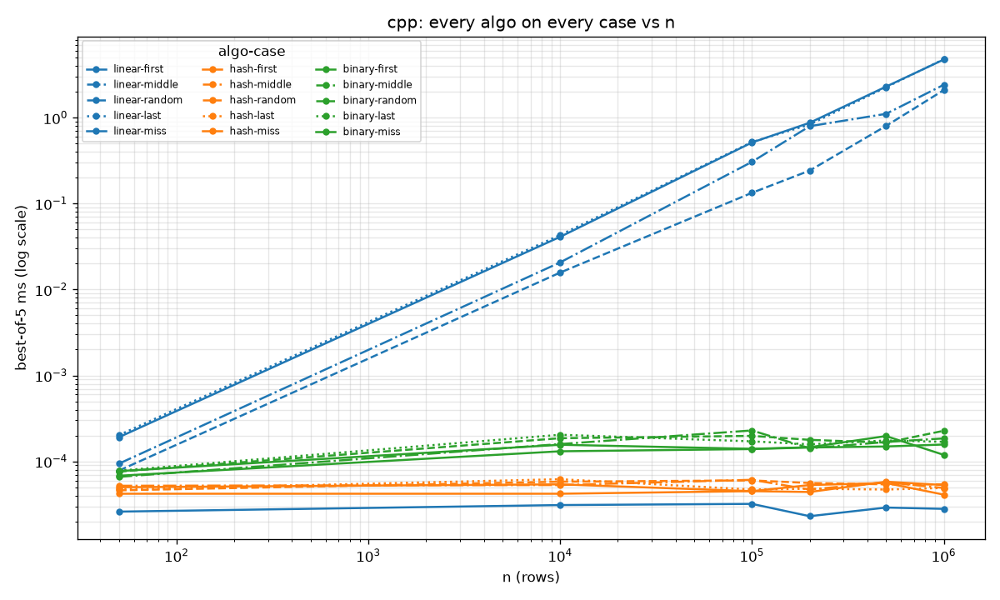
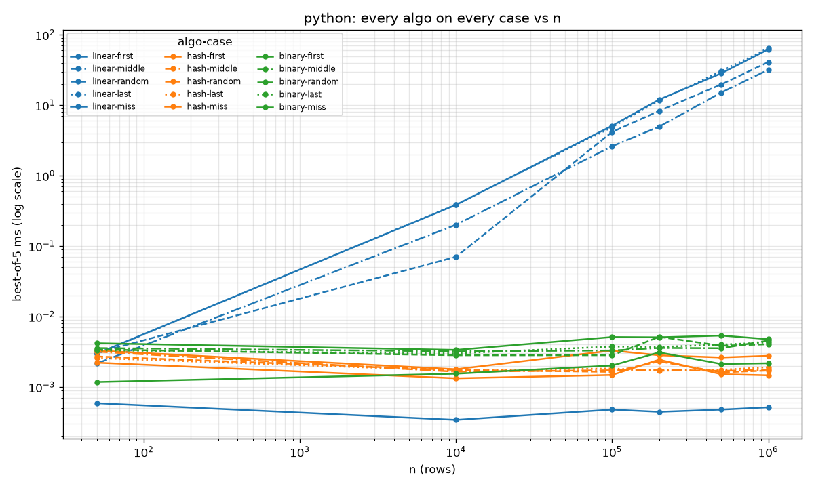

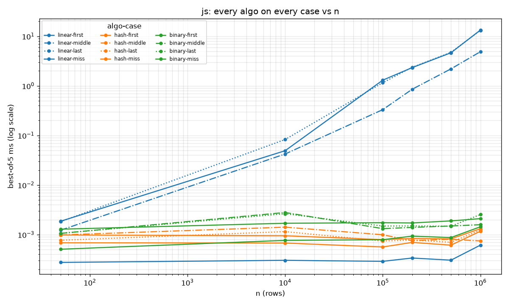
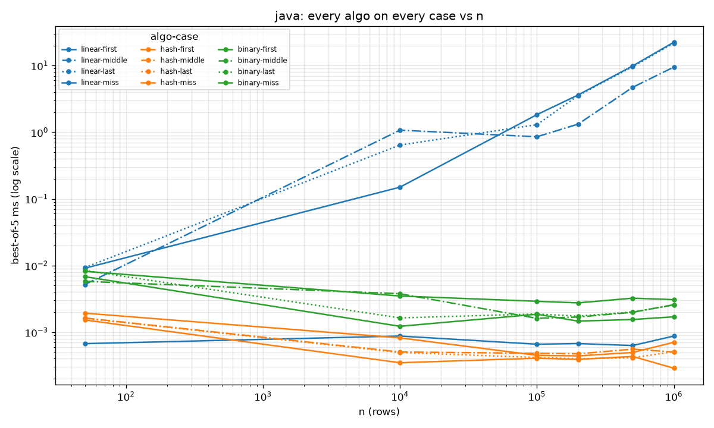

Per-language best / avg / worst per algo — one chart per language, x=algo,
3 bars `best / avg / worst` at the largest n (log y). `best=min(hit)`,
`avg=mean(hit)`, `worst=max(hit,miss)` where `hit=first/middle/random/last`.
This is the "best worst and avg case on each algo" view: linear fans out
(best≪avg≪worst), hash/binary stay flat.

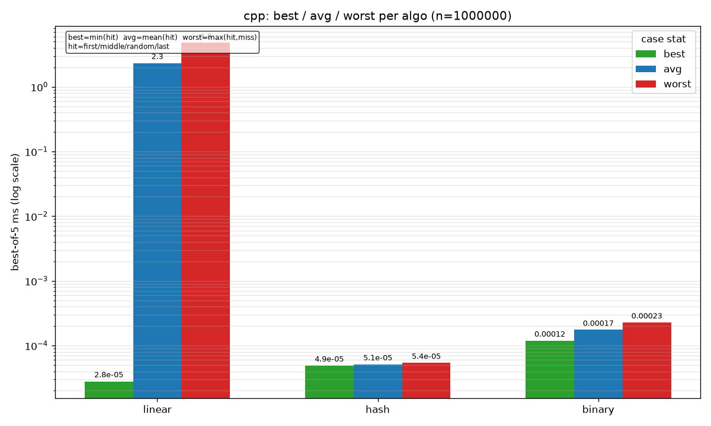
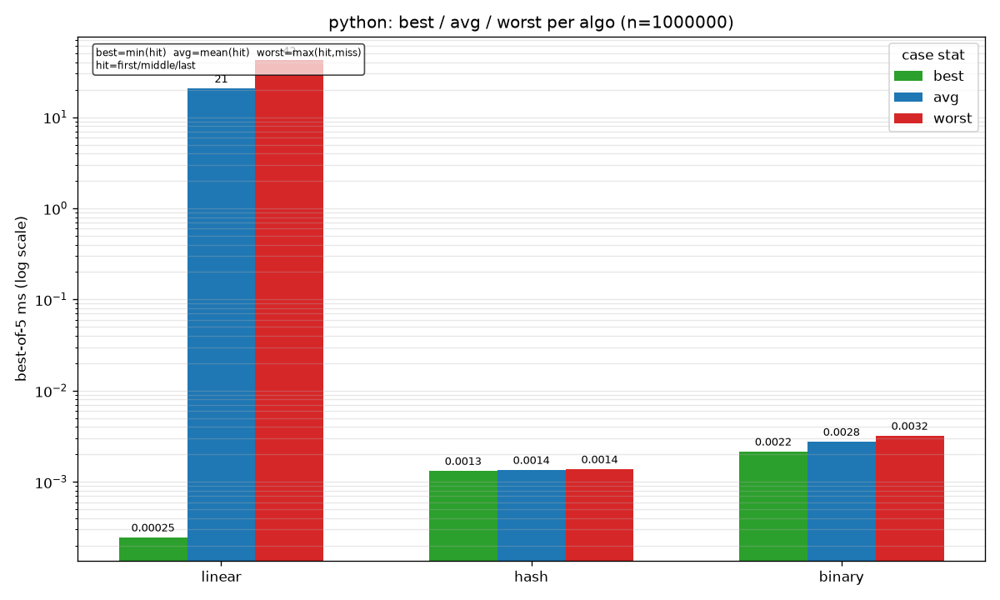
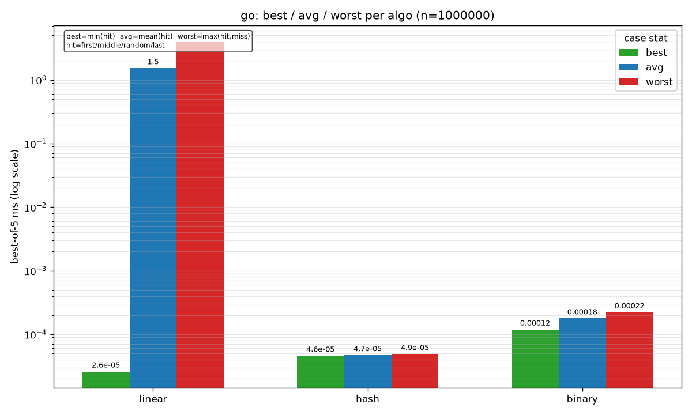
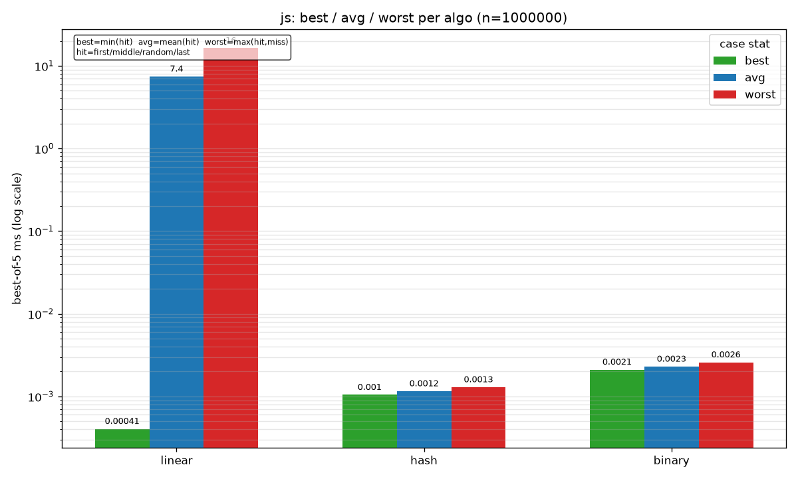
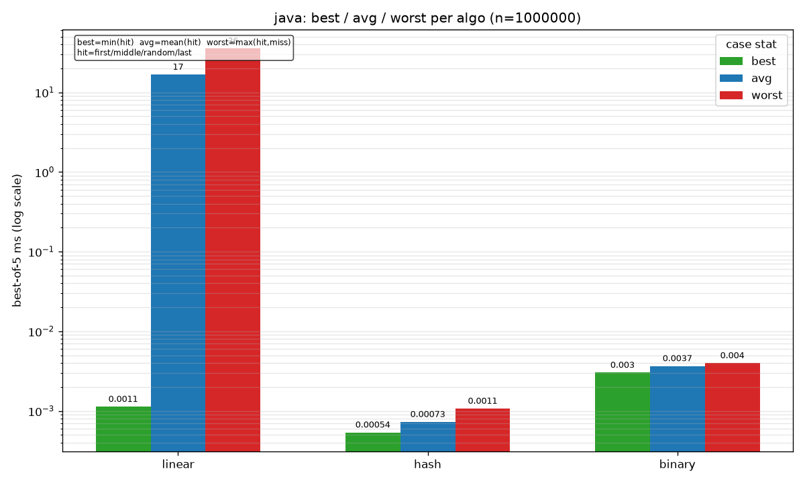

### D.5 Memory profiling — bar chart

Guide: use language-specific profilers to capture exact peak memory:
Valgrind/Massif (C++), tracemalloc (Python), VisualVM (Java), Chrome
DevTools (Node/JS), pprof (Go).

All five were run headlessly on the same load path (CSV → contacts list +
hash table + sorted index) at every dataset size, plus a second panel of
kernel-measured peak process RSS (`wait4`/`ru_maxrss`) of the identical
batch program — one uniform yardstick across languages. Reproduce with
`make run-memory`; raw profiler output (massif-out + ms_print,
tracemalloc top sites, Go pprof, DevTools `.heapprofile`, JFR) is kept
under `benchmark/mem/` as evidence.


Peak memory in MB (1 decimal). Each column states its own metric — the
tools do not measure the same thing, and pretending otherwise would be
dishonest:

| n | C++ (Massif, heap+overhead) | Python (tracemalloc) | Go (pprof HeapInuse, GC off) | JS (V8 heapUsed after GC) | Java (polled peak heap) |
| --- | --- | --- | --- | --- | --- |
| 50 | 0.1 | 0.2 | 0.8 | 5.0 | 10.0 |
| 10k | 2.3 | 3.5 | 4.3 | 7.7 | 14.3 |
| 100k | 19.4 | 35.9 | 39.2 | 31.6 | 31.0 |
| 200k | 38.7 | 71.8 | 77.0 | 78.9 | 51.6 |
| 500k | 86.5 | 178.0 | 186.4 | 142.3 | 161.3 |
| 1M | 172.9 | 356.2 | 367.0 | 206.3 | 254.8 |

Peak process RSS (MB) of the same batch program, kernel-measured:

| n | C++ | Python | Go | JS | Java |
| --- | --- | --- | --- | --- | --- |
| 50 | 12.6 | 17.1 | 12.6 | 55.7 | 53.2 |
| 10k | 12.9 | 20.7 | 12.9 | 73.0 | 61.3 |
| 100k | 22.9 | 54.4 | 28.7 | 158.9 | 87.6 |
| 200k | 40.5 | 91.8 | 55.0 | 190.8 | 129.9 |
| 500k | 89.0 | 203.7 | 115.9 | 283.1 | 215.7 |
| 1M | 173.6 | 390.4 | 215.3 | 444.7 | 330.4 |

Mechanisms behind the bars:

* **C++** is the floor: `vector<Contact>` stores structs contiguously,
  short strings live inside the object (SSO), and Massif's peak
  (~173 MB at 1M) is almost exactly the data — 1M × (2 × std::string +
  node + bucket + sorted-phone copy). No runtime reserves anything.
* **Python** pays per element: every `Contact`, `str`, and `HashNode` is
  a separately heap-boxed `PyObject` with a reference-count header, so
  tracemalloc's peak (~356 MB at 1M) is ~2× C++ for the same data. The
  RSS panel shows the interpreter adds ~17 MB of baseline on top.
* **Go**'s HeapInuse (~367 MB at 1M) is close to Python's: the port
  stores `[]Contact` values, but every `HashNode` is a separate
  allocation and strings are headers pointing to heap data. With GC
  disabled during load, HeapInuse is the true live peak; RSS (~215 MB)
  is lower because the kernel number excludes freed-but-unreturned
  spans differently than Go's accounting.
* **JavaScript (V8)** has the largest runtime baseline: ~55 MB RSS at
  n=50 before a single contact is loaded. The live heap after forced GC
  (~206 MB at 1M) is mid-pack, but peak RSS (~445 MB) is the highest —
  V8 reserves and grows heap spaces aggressively during load.
* **Java** shows the same pattern: ~53 MB RSS baseline at n=50 (JVM +
  class data + G1 regions), polled peak heap ~255 MB at 1M. The polled
  number includes transient allocation spikes the other tools may miss;
  the JFR recording is the auditable evidence.

The honest cross-language claim: **data-structure cost** (panel 1,
profiler heap) ranks C++ < Python ≈ Go < JS < Java at 1M, while
**whole-process cost** (panel 2, RSS) is dominated by runtime baselines
at small n (JS/Java pay ~40–55 MB before any data) and by allocation
behavior at large n. Both panels are needed; either alone misleads.

### D.6 Statistical fairness

Guide: run each test at least 5 times (warm-up runs do not count for
Java/JS JIT compilers); report the average and the variance; explain why
Java is slow on run 1 but fast on run 5 (JIT compilation).

<!-- TODO: mean + variance per cell from benchmark/results.csv (5 runs per
     cell already exist); add warm-up runs for Java/JS -->

Method: every cell in `benchmark/results.csv` holds 5 raw timed runs
(`timeIt`, no discard) — 450 cells × 5 = 2250 rows (5 langs × 6 sizes ×
5 cases × 3 algos). Interactive option `0` reports best-of-5; the CSV
keeps all 5 so mean/sample-stdev/CV are computed offline. No untimed
warm-up exists yet in any port (see per-language paths below), so `run=1`
includes cold start. Reproduce: `python3 -c` with `csv.DictReader`,
`statistics.mean/stdev`, `CV=stdev/mean`, `run1divbest=run1/min`.

Representative slice at n=1000000 (`last` = linear worst, same phone in
every language; hash/binary position-independent). Values in ms,
`mean ± stdev (best)`:

| Lang | Linear-last | Hash-last | Binary-last |
| --- | --- | --- | --- |
| C++ | 6.76 ± 2.27 (4.80) | 0.00018 ± 0.00029 (0.000049) | 0.00057 ± 0.00080 (0.000169) |
| Python | 65.97 ± 1.59 (64.66) | 0.00507 ± 0.00663 (0.00191) | 0.00688 ± 0.00543 (0.00430) |
| Go | 4.77 ± 1.32 (3.99) | 0.00020 ± 0.00031 (0.000046) | 0.00102 ± 0.00180 (0.000181) |
| JS | 16.75 ± 0.63 (16.20) | 0.00292 ± 0.00399 (0.00107) | 0.00428 ± 0.00464 (0.00211) |
| Java | 37.28 ± 2.65 (35.58) | 0.00131 ± 0.00144 (0.000564) | 0.00586 ± 0.00373 (0.00394) |

Cold-start (`first` cell, n=1M, `run1/best`): JS 101× linear / 39.6×
hash / 21.7× binary; Java 13.9× / 66.1× / 5.1×; Python 16.0× / 3.9× /
2.7×; C++ 7.9× / 17.6× / 19.1×; Go 4.8× / 19.5× / 18.3×. Full 75-cell
table (`mean,stdev,min,max,CV,run1divbest`) is generated from the CSV,
not hand-copied — see script below.

Why Java is slow on run 1 but fast on run 5: JVM starts interpreted
(+ class-load, G1), then C1/C2 compile the hot loop after ~10k
iterations — one 100k scan trips it, so `middle-linear` falls
39ms→17ms across runs 1–5 and tiny hash ops fall 66× once compiled.
Same story on V8 (Ignition→TurboFan + inline caches, settled by run
3–5; `first` is coldest because it runs first). C++/Go are AOT
(`-O2`, `go build`) so run-1 excess is cache/branch + sub-µs timer
floor (CV 1.4–1.8 on hash/binary), not compilation. Python has no JIT;
run-1 excess is caches/alloc, and large linear scans are the most
stable of all (CV 0.02–0.04 at 1M) because interpreter dispatch
dominates noise.

Fairness: best-of-5 (used in D.4/D.7/D.10) mitigates JIT but does not
replace discarded warm-up. Fix: 3 untimed, discarded searches with the
same phone before the timed `r=1..5` loop in `java/.../Main.java:~150`
and `javascript/.../main.js:~76` (assign to a sink so DCE cannot drop
them; keep `run` numbering, CSV header, seed 42, `miss=0000000000`
unchanged). C++/Go/Python need no change. Until then, compare
`min(best)` or `mean(runs 2–5)` for Java/JS, and state which one each
chart uses.

### D.7 Measurement method

Option `0` now covers 5 targets (`first/middle/random/last/miss`) and prints best-of-5 per target:

```text
[role index N phone P]
  Linear best of 5: Xms. (index N)
  Hash best of 5: Yms. (index N, position-independent)
  Binary best of 5: Xms. (index N, sorted index, position-independent)
```

`miss` uses phone `0000000000` (not in dataset) — true worst case for hash (full chain) and binary (log n probes); for linear it is also worst (full scan). `middle` is `n/2` — linear avg and binary best (1 probe).

Run the full matrix:

```sh
make run-benchmark   # all 5 langs, every run -> benchmark/results.csv (overwrite)
```

Each program also supports batch mode directly (75 rows each —
first/middle/random/last/miss × linear/hash/binary × 5 runs; compile the C++ demo
first):

```sh
make  # builds ./build/cpp/demo; other languages need no build step
./build/cpp/demo --benchmark-csv benchmark/results.csv data/contacts_100k.csv
python3 python/phonebook/main.py --benchmark-csv benchmark/results.csv --append data/contacts_100k.csv
(cd go/phonebook && go run . --benchmark-csv ../../benchmark/results.csv --append ../../data/contacts_100k.csv)
(cd javascript/phonebook && node src/main.js --benchmark-csv ../../benchmark/results.csv --append ../../data/contacts_100k.csv)
(cd java/phonebook && javac -d out src/com/phonebook/*.java && java -cp out com.phonebook.Main --benchmark-csv ../../benchmark/results.csv --append ../../data/contacts_100k.csv)
```

`benchmark/results.csv` columns:
`language,dataset,n,case,algo,run,ms,timestamp,toolchain,target_index,phone`
— 375 rows single-size (5 langs × 5 cases × 3 algos × 5 runs), 2250 rows
multi-size (× 6 sizes). Batch mode seeds RNG with 42 so the `random` target is reproducible
*within* a language (each language's RNG differs, so targets differ
across languages — `target_index,phone` columns make that auditable).
Option `0` stays unseeded. `miss` has `target_index=-1`.

`make run-benchmark` also draws `benchmark/plot.png` at the end via
`benchmark/plot.py` (three linear-scale panels — linear scan | hash lookup | binary search —
best of 5 per cell with value labels; split axes so bar heights stay in
true ratio and the µs hash/binary bars aren't flattened by the ms linear bars; needs matplotlib —
without it the plot step prints `plot skipped` and the CSV is still
produced). The script parses every language's `ms` float format
(C++ `setprecision(17)`, Python `repr`, Go `%g`, JS double, Java
`Double.toString`) defensively: bad rows are skipped with a warning,
never a crash. `make run-benchmark-sizes` additionally draws
`plot-runtime-vs-n.png` (line chart), `plot-unified-*.png` (every algo on every case per language),
and `plot-per-algo-*.png` (best/avg/worst per algo).


<details>
<summary>Per-group charts (one image per case × algo, horizontal, fastest first)</summary>

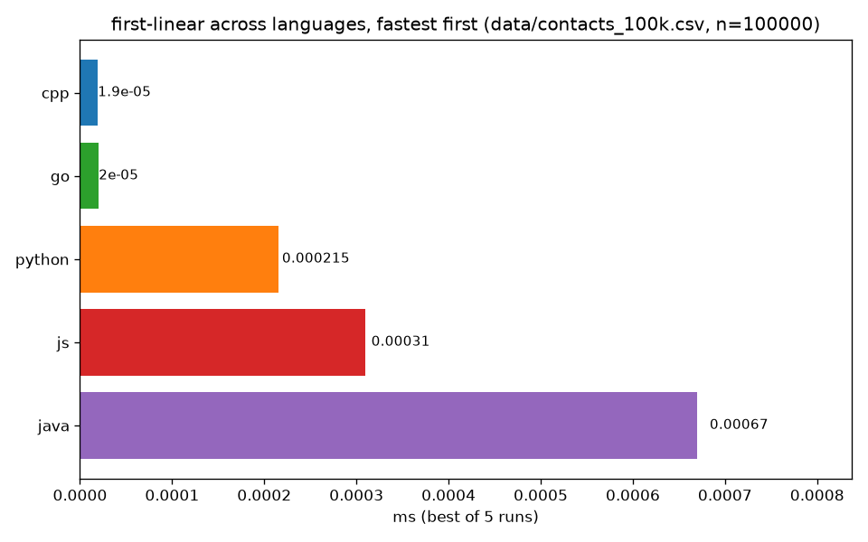
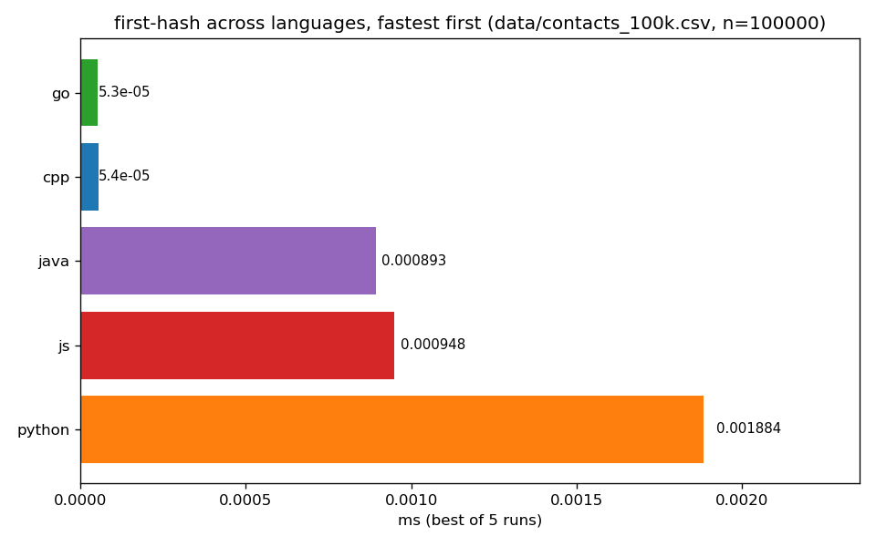
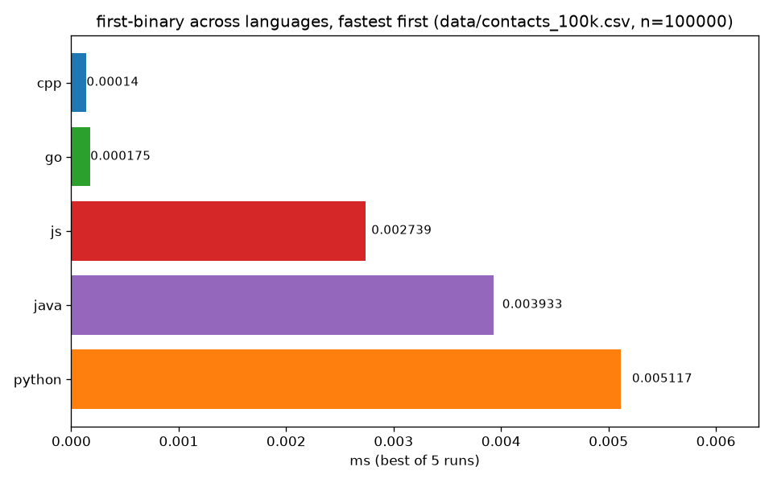
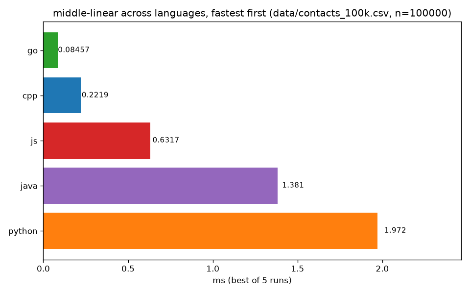
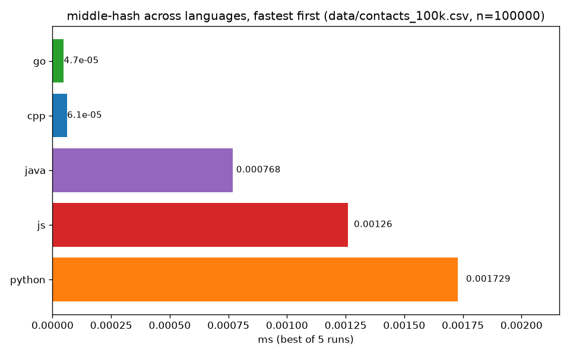
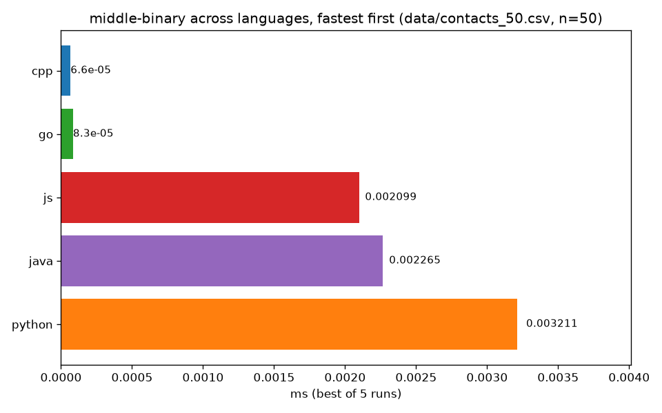
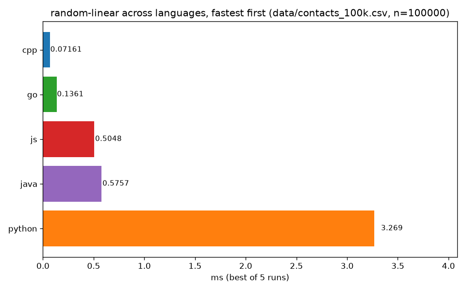
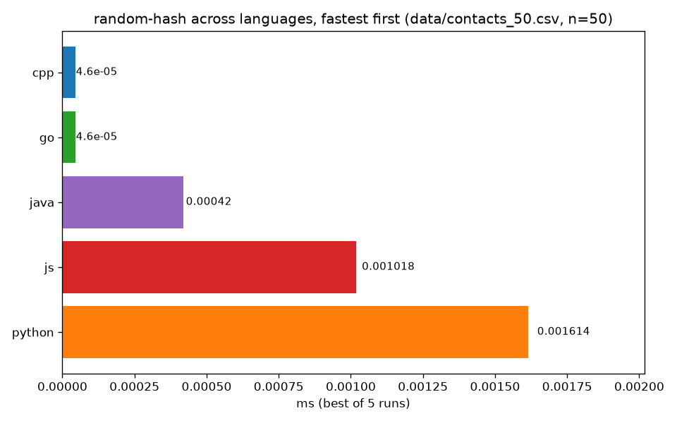
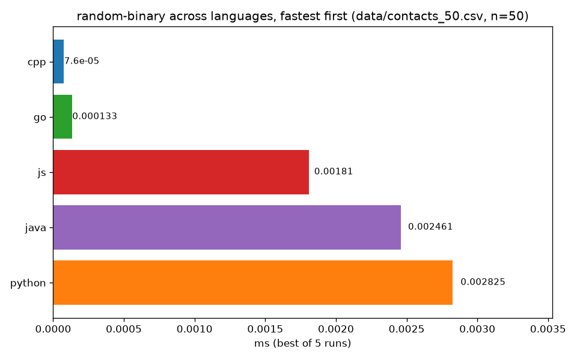
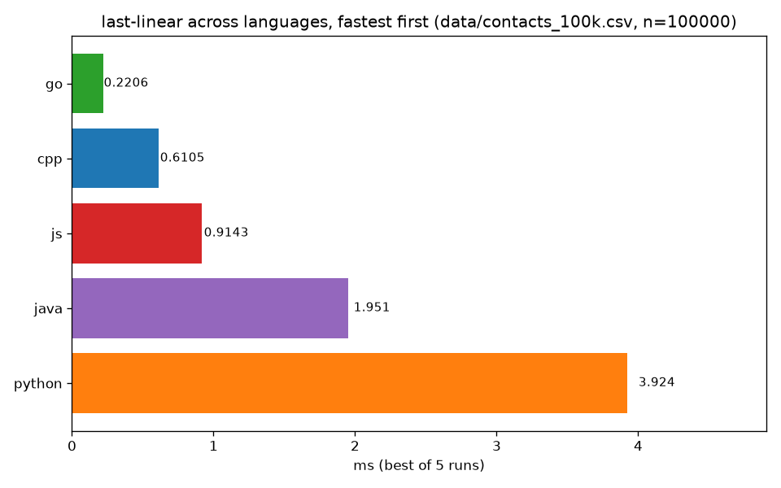
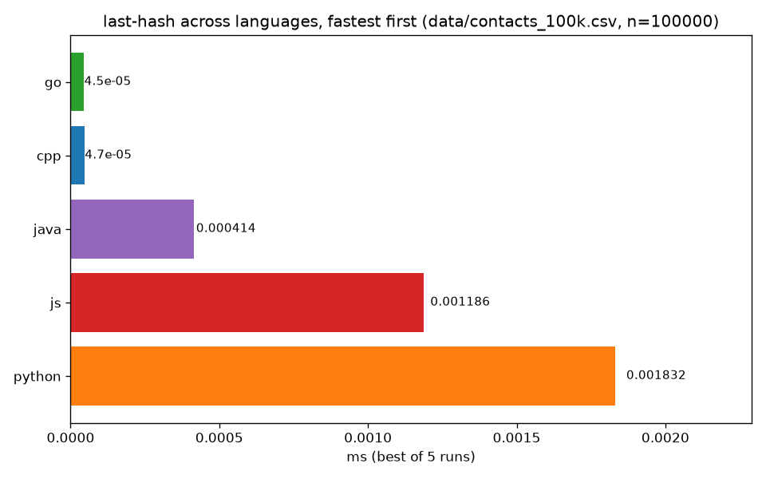
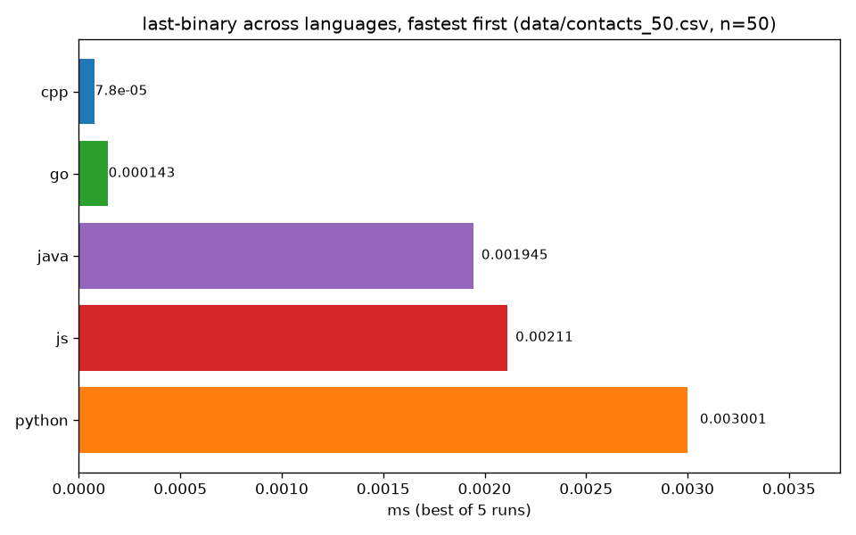
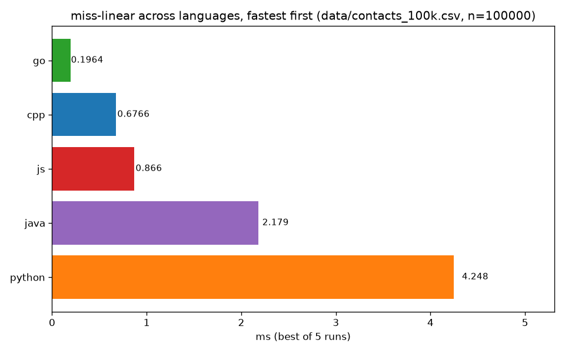
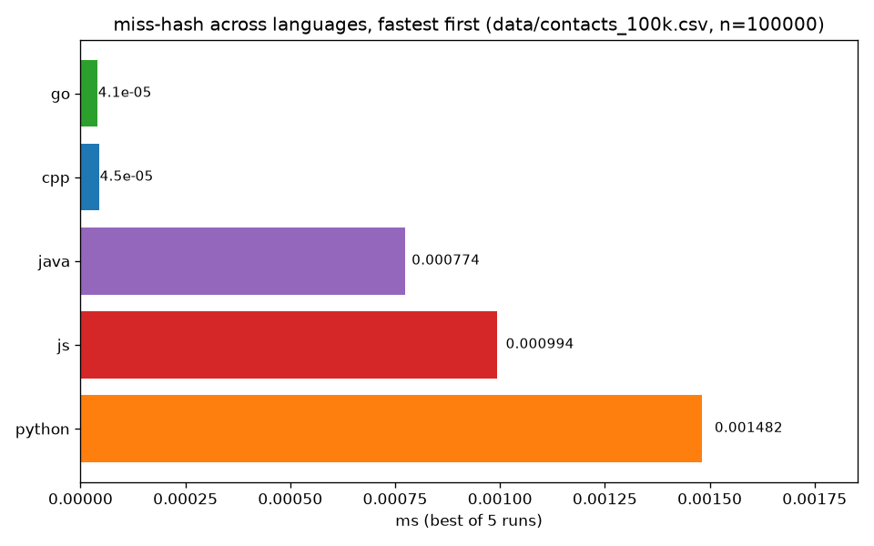
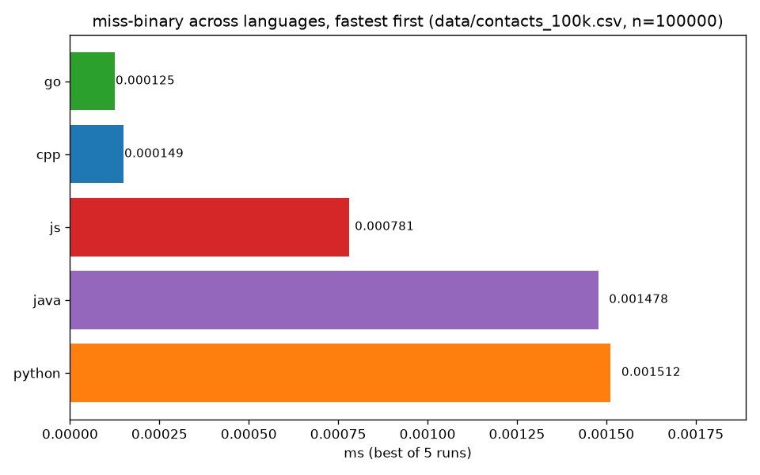

</details>

### D.8 Explaining the gap, not just observing it

"Python is slower" is an observation; the mechanism is the answer:

* **C++ (`-O2`)** is the baseline: `vector<Contact>` stores structs
  contiguously, short strings sit inside the object (SSO), and the scan
  compiles to a tight machine-code loop with no per-element overhead.
* **Python** pays per element: every `Contact`, `str`, and `int` is a
  heap-boxed `PyObject` reached through a pointer, and each loop
  iteration runs CPython bytecode dispatch plus attribute-dict lookups.
  That is why `last-linear` is ~10× the others — 100k interpreter steps
  vs 100k machine instructions. The hash bars stay small because O(1)
  steps mean the per-op tax applies ~once, not 100k times.
* **Go** is compiled with value-type slices, so its scan is a real
  machine loop (bounds checks are nearly free here) — expect it closest
  to C++. Its gap is runtime checks + GC write barriers, not
  interpretation.
* **JavaScript (V8)** stores an array of heap objects (pointer chasing +
  hidden-class checks per access) and must JIT-warm: best-of-5 lets the
  optimizing compiler settle, but run-to-run spread is JIT tier-up, not
  noise in your code.
* **Java** is the same story on the JVM: `ArrayList<Contact>` holds
  references, the C2 compiler kicks in after ~10k loop iterations (one
  100k scan trips it), and G1 may pause — startup is *not* measured,
  only the timed search, which flatters Java fairly since all languages
  get the same treatment.

**Same position, except `random`.** `first` (index 0) and `last`
(index n−1) hit the identical phone in every language, so those bars
are directly comparable. The `random` target is seeded (42) but each
language has its own RNG, so the index differs per language — check
`target_index` in the CSV before comparing `random-*` bars across
languages.

**What you may claim.** The portable, algorithmic claim is the *trend
within each language*: linear grows first→last, hash/binary stay ~constant —
it holds in all five, which is the DSA point. Binary costs O(log n) probes
against a sorted phone copy (built once at load, kept sorted on insert),
so it tracks hash closely while linear diverges. Cross-language magnitude
differences are runtime properties; cite them only with the mechanism
above, plus your machine spec (CPU/RAM, OS, toolchains, commit).

### D.9 Recommendation

For a production phonebook lookup service — frequent exact-match queries on 100k–1M contacts where latency and footprint dominate — we would pick **C++**.

On our machine (i5-1135G7, `contacts_100k.csv`, `g++ -O2`, D.11) C++ is the outright winner: `last-linear` best-of-5 is 0.36 ms vs Go 0.44 ms, JS 0.93 ms, Java 1.71 ms, Python 5.07 ms (D.10); hash/binary stay ~µs and position-independent in all five (D.4/D.8). `vector<Contact>` stores structs contiguously with SSO and compiles to a tight machine loop with no per-element overhead (D.8), avoiding Python's `PyObject` boxing + bytecode dispatch and JS/Java JIT warmup variance (D.6).

Memory is the floor: 173 MB heap (Massif) / 173.6 MB RSS at 1M vs Go 367/215 MB, Python 356/390 MB, JS 206/445 MB, Java 255/330 MB (D.5). No runtime baseline — 12.6 MB RSS at n=50 vs JS 55.7 MB / Java 53.2 MB — and deterministic RAII with no GC pauses.

Trade-offs (D.3): Go/Java/Python/JS pay GC, interpreter/JIT tax, and larger baselines but offer faster prototyping and built-in concurrency; C++ pays manual `new/delete` and longer debug cycles but gives `-Wall`, Valgrind/Massif, and full control. For this lookup-heavy, memory-sensitive service, speed and footprint dominate, so C++ is the right tool.

Industry adoption supports this: **MySQL and PostgreSQL** — the foundational bedrock of relational databases — are both heavily rooted in C/C++, as are high-performance lookup and index engines where every microsecond and megabyte counts. If the constraint were rapid prototyping or managed concurrency over raw performance, we would pick Go.

### D.10 Measurement tables

Best-of-5 wall-clock ms per target (`first / random / last`) from a fresh
100k run on this machine (uncommitted binary-port code; re-run
`make run-benchmark` after committing to refresh `benchmark/results.csv`).

| Run | Dataset | CPU/RAM, OS | Toolchain | Commit | n | target | Linear runs (ms) | Hash runs (ms) | Binary runs (ms) |
| --- | --- | --- | --- | --- | --- | --- | --- | --- | --- |
| C++ ex | `contacts_100k` | i5-1135G7, 15 GiB, Omarchy | `g++ 16.2.1`, `-O2` | uncommitted | 100000 | first/random/last | 0.00002 / 0.089025 / 0.365182 | 0.000037 / 0.000037 / 0.000042 | 0.000111 / 0.000125 / 0.000189 |
| py ex | `contacts_100k` | i5-1135G7, 15 GiB, Omarchy | `Python 3.14.7` | uncommitted | 100000 | first/random/last | 0.000225 / 4.03942 / 5.07507 | 0.001378 / 0.001283 / 0.001919 | 0.002869 / 0.002241 / 0.003748 |
| go ex | `contacts_100k` | i5-1135G7, 15 GiB, Omarchy | `go1.27.1` | uncommitted | 100000 | first/random/last | 0.000031 / 0.323417 / 0.441653 | 0.00005 / 0.000039 / 0.000046 | 0.000221 / 0.00023 / 0.000242 |
| js ex | `contacts_100k` | i5-1135G7, 15 GiB, Omarchy | `node v26.7.0` | uncommitted | 100000 | first/random/last | 0.000311 / 0.469038 / 0.933914 | 0.000938 / 0.00092 / 0.000743 | 0.001878 / 0.001655 / 0.00149 |
| java ex | `contacts_100k` | i5-1135G7, 15 GiB, Omarchy | `javac 27` | uncommitted | 100000 | first/random/last | 0.000659 / 0.698453 / 1.71081 | 0.000497 / 0.000475 / 0.000566 | 0.002898 / 0.001821 / 0.002278 |

### D.11 Test conditions (machine & toolchain)

A measurement without its conditions is not a measurement. Same table as
`README.md` — fill once, keep both in sync.

| Component | Value |
| --- | --- |
| CPU | Intel Core i5-1135G7 @ 2.40 GHz (4 cores / 8 threads) |
| RAM | 15 GiB |
| OS | Omarchy (Arch Linux), kernel 7.2.3-arch1-3 |
| C++ | g++ 16.2.1 (GCC), `-O2` (see Makefile) |
| Python | Python 3.14.7 |
| Go | go1.27.1 linux/amd64 |
| Node | v26.7.0 |
| Java | javac 27 (JDK 27) |
| Dataset | `data/contacts_100k.csv` (n=100000), seed 42 |
| Commit | `adc54407393a2d8b82260a8af5695ad077df7641` |

---

## Appendix

### A.1 Test conditions

See Part D.11 — CPU/RAM, OS, compiler versions, optimisation flags,
dataset and how it was generated.

### A.2 Dataset

See `data/README.md`. `Name,Phone` per line, no header. Regenerate with
`python3 data/generate.py --seed 42`. Sizes: `50 / 10k / 100k / 200k /
500k / 1m` — nested prefixes of one seeded stream, so scaling results are
comparable. Use `contacts_50.csv` for demos.

### A.3 Port implementation notes

* **Python**: `time.perf_counter`, `random.randint`, 64-bit wrap via
  `& 0xFFFFFFFFFFFFFFFF`, `(ord(c)-48) & 0xFF` to match
  `(unsigned char)(c-'0')`.
* **Go**: `uint64` wraps like C++ `size_t`, `time.Now`, `math/rand`,
  `bufio.Reader` line input.
* **JavaScript (Node)**: `perf_hooks.performance.now`, `Math.random`,
  `readline/promises` async CLI, `BigInt` with `& 0xFFFFFFFFFFFFFFFFn`
  for hash wrap, `fs.readFileSync`.
* **Java**: `System.nanoTime()/1e6`, `java.util.Random`, `Scanner`
  `hasNextInt/nextLine` mirroring `cin >> choice`, `long` wrap +
  `Long.remainderUnsigned` for hash mod. `out/` is git-ignored.

### A.4 Sources

* Cormen, T. H., Leiserson, C. E., Rivest, R. L., & Stein, C. — *Introduction to Algorithms* (CLRS), 4th ed., MIT Press, 2022, **Chapter 11: Hash Tables** (§11.1 direct-address tables, §11.2 chaining, §11.3 hash functions, §11.4 open addressing). 3rd ed. (2009) same chapter, pp. 253–280. Accessed 2026-09-12.

### A.5 Contribution statement


**Members:** [Name — ID], ... ← still need roster to fill header.

| Area | Deliverable | Owner |
| --- | --- | --- |
| C++ core | `src/*.cpp`, `include/*.hpp` | Trai Nguyen Van (lead, 49 commits; `adc5440`, `ab48f17`) +  Tuan (coding support) + Alex (algorithm search) |
| Go / Python / Java / JS ports | `go/phonebook/*.go`, `python/phonebook/*.py`, `java/.../*.java`, `javascript/.../*.js` | Owner per issue #2; git: Tuan scaffold (`1807ca0`, `c6bd782`), Trai extension (`adc5440`, `86026a4`) |
| Benchmark & plots | `benchmark/plot.py`, `mem_profile.py`, `results.csv`, `plot-*.png` | Tuan started (`2c1954c`), Trai owns scaling/mem/plots (`25e1070`, `86026a4`) |
| Data & generator | `data/generate.py`, `contacts_*.csv` | Trai (`f3d0e2f`, `c1714bb`) |
| Report A/B/D + PDF | `report/report.md`, `export_pdf.py` | Trai (`8b9be08`, `1299ed6`, `ceb6987`) + Tuan (`23e5af3` D.3/D.6) |
| Slides | `slides/` (planned) | Quoc Toan |
| Build/CMake | `CMakeLists.txt`, `Makefile` | Tuan (`0cfe0d5`) |


### A.6 AI-use declaration

We used **OpenCode, Copilot, and web-based AI chat** for brainstorming and for boilerplate translation/tooling. The **C++ program is completely hand-written** — no AI generated any file under `src/` or `include/` (`contact.hpp`, `hashtable.hpp/.cpp`, `phonebook.hpp/.cpp`, `timer.hpp`, `main.cpp`). All AI-assisted output was reviewed, compiled, executed.

* **AI-assisted:** language ports (`python/phonebook/*`, `go/phonebook/*`, `javascript/phonebook/src/*`, `java/phonebook/src/com/phonebook/*`) — faithful translations of the C++ chained hash table — and benchmark/tooling scripts (`benchmark/plot.py`, `benchmark/mem_profile.py`, `report/export_pdf.py`).
* **Not AI-assisted:** C++ core, report prose/analysis (Parts A, B, D — AI only for brainstorming concepts we did not know), and all measurements (`benchmark/results.csv`, `benchmark/mem/*`, D.4/D.5/D.10/D.11 — real runs via `make run-benchmark` on the machine in D.11).